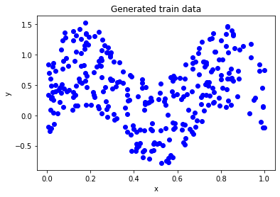
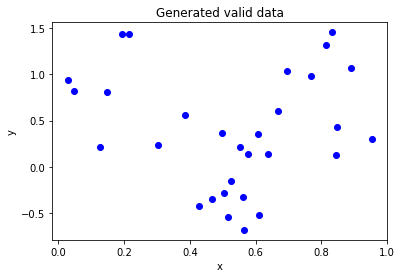
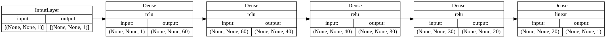
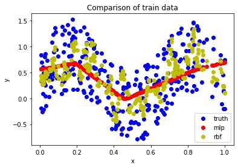
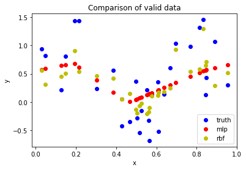

This repository contains the implementation and training of a Radial Basis Function (RBF) network on a dataset. The results are then compared with those obtained from an MLP implemented with Keras.

# Dataset

The dataset is generated using the following equation:
$$y = \frac{1}{3} + 0.5 \cdot \sin(3x\pi) + \mu \quad \text{for} \quad 0 < x < 1 \quad \text{and} \quad -0.7 < \mu < 0.7$$

<table class="tg">
<tbody>
<tr>
<td>

</td>
<td>

</td></tr>
</tbody>
</table>

# Implementations

## RFB

### Centers
To find RBF layer centers, two methods are used:

1. K-Means clustering
2. a Gaussian mixture model probability distribution

### Radius
The radius is found by finding the maximum distance between each two centers.

## MLP
To implement MLP, keras library is used.

- Model architecture

# Results

<table class="tg">
<tbody>
<tr>
<td>

</td>
<td>

</td></tr>
</tbody>
</table>

